# AutoSumo Robot

Robot used in the AutoSumo arena. Remote controlled by the [Bot Server](https://github.com/AutoSumo/server) using websockets.

```mermaid
flowchart TD
    web["🌐 Web Interface"] -->|uploads code| code-server[("💾 Code Server")]
    code-server -->|highlight data| web
    code-server -->|downloads code| bot-server["💻 Bot Server"]
    bot-server -->|highlight data| code-server
    bot-server -->|motor instructions| robot["🤖 Robot\n(this)"]
    robot -->|sensor data| bot-server
    tag-server["📷 Tag Server"] -->|apriltag positions| bot-server
    
    style robot stroke-width:2px,stroke-dasharray: 5 5,stroke:#3b82f6
    
    click web "https://github.com/AutoSumo/web"
    click code-server "https://github.com/AutoSumo/code-server"
    click bot-server "https://github.com/AutoSumo/server"
    click tag-server "https://github.com/AutoSumo/tag-server"
```

https://user-images.githubusercontent.com/26680599/185769401-c024f6a5-496c-4001-9858-a5e7ccef9a41.mp4

### Hardware

 - ESP32 used for communication and processing
 - Dual H-Bridge motor driver chosen for size and efficiency
 - Back-mounted rechargable battery
 - Two DC motors for drive

Sensors:
 - Two infrared line sensors mounted to the front of the robot
 - Single-point LIDAR mouinted to a servo with a 180 degree range of motion
 - Two infrared tachometers (one for each wheel)

Robot body is fully 3D printed and assembled using M3 screws and nuts.